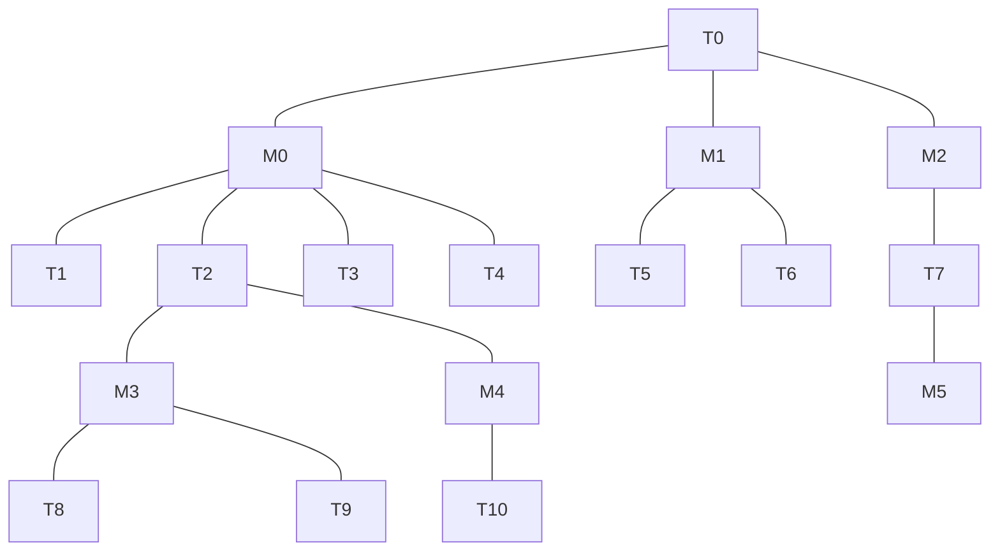

#为什么需要记录一个任务持有了哪些锁？

因为锁是很重要的资源，记录一个任务持有哪些锁大有好处：

1. 调试时可以查看任务持有锁的情况。
2. 任务以外挂掉的话，系统可以帮忙释放锁。
3. 当一个任务持有多个锁，其中的任何一个或多个锁都可能会有新的高优先级的任务等待，那么当其中某个锁释放的时候，需要根据还剩余持有的锁计算新的优先级。

#锁为何需要保存优先级信息？
锁本身没有优先级，锁里面记录的优先级是这个锁的等待队列中所有任务最高优先级的一个缓存。如果没有这个信息，当前面第三点中描述的任务释放一个锁的时候计算新的优先级就比较耗时。如果每个锁已经保存了等待队列中最高优先级数值，那么重新计算任务优先级的时候，只需要计算所有还持有的锁保存的最高优先级以及当前任务原本优先级的最大值即可。锁保存的最高优先级的更新时机为：

1. 有高优先级的任务进入当前锁的等待队列时
2. 锁中某个任务超时，从锁的等待队列中删除时
3. 锁被释放的时候，从锁的队列头取出新任务时

优先级继承关系类似一棵树，例如下图：

在这张图中，T0的优先级应该是：
$$
prio_{T0}=MAX\left(prio_{T0}, prio_{T1}, prio_{T2}, prio_{T2}, prio_{T3}, prio_{T4}, prio_{T5}, prio_{T6}, prio_{T7}\right)
$$
同理，T2的优先级应该是：
$$
prio_{T2}=MAX\left(prio_{T2}, prio_{T8}, prio_{T9}, prio_{T10}\right)
$$

当T2释放M4的时候，T2新的优先级应该是：
$$
prio_{T2}=MAX\left(prio_{T2}, prio_{T8}, prio_{T9}\right)
$$

由此可见当mutex持有情况比较复杂的时候计算是很复杂的，如果我们在mutex中增加一个`prio`域用来记录当前mutex下所有任务的优先级最大值，并随时保持更新这个值（参加前文描述的更新时机），那么有新任务pend，超时删除时更新这个域会减少计算量。因为只有遇到这两种情况才需要计算，计算量比较少。否则每次都要遍历所有。比如对于记录在M0中的`prio`应该是：
$$
prio_{M0}=MAX\left(prio_{T1}, prio_{T2}, prio_{T2}, prio_{T3}, prio_{T4}, prio_{T8}, prio_{T9}, prio_{T10}\right)
$$
因为M3，M4同样有`prio`域，所以记录在M0的`prio`也是：
$$
prio_{M0}=MAX\left(prio_{T1}, prio_{T2}, prio_{T2}, prio_{T3}, prio_{T4}, prio_{M3}, prio_{M4}\right)
$$

如果随时保持每一个任务，mutex的优先级更新那么释放mutex时任务的新优先级（包括当前任务，从mutex的pend queue里唤醒的新任务）就很容易了。否侧每次都要遍历计算。

# 实现细节
1. 每个锁的等待队列实现为优先级队列，等待队列中优先级最高的任务就是第一个任务
2. 每个任务的TCB中都有一个名为`mutex_owned`双向链表头，当前任务获取到的所有的锁会被链接进来，这样
3. 当任务pend在一个锁上或一个锁因超时从一个锁的等待队列中去除时，保存在锁中的优先级信息可能会发生改变
4. 锁的优先级发生改变时，需要检查是否需要更新锁的owner的优先级（pend可能上升，timeout可能下降）
5. 当一个任务优先级发生变化时（参见4），假设它有期望获取的锁，那么可能需要更新这个锁中的优先级并调整自己在此优先级等待队列中的位置。从而回到（3）的状态。

